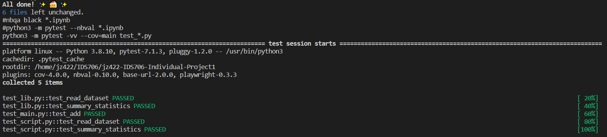
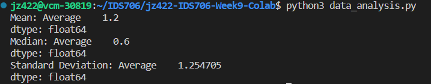
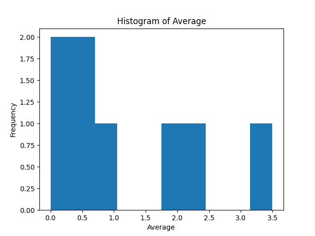
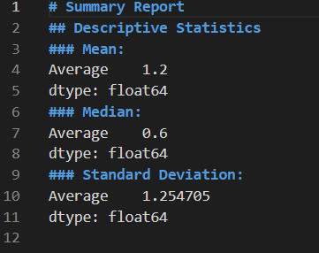
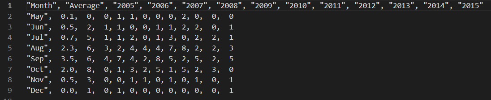

# IDS706-Week9-Colab

This repository sets up an environment on CodeSpaces and uses GitHub Actions to run a Makefile for the following commands: make install, make test, make format, and make lint.

## Cloud-Hosted Notebook Data Manipulation
Cloud-hosted Jupyter Notebook using Google Colab

## Getting Started
To set up the project, simply run make all or run make install and make test.

## Features
### Data Analysis
Included are a Jupyter Notebook Descriptive_Statistics.ipynb and a Python script data_analysis.py that both perform basic data analysis tasks using Pandas:

- Reads a dataset from a CSV file
- Generates summary statistics like mean, median, and standard deviation
- Creates a histogram for a specified column in the dataset

### How to Use the Data Analysis Script
1. Place your CSV file in the same directory as the script or update the file_path variable in the script to point to your CSV file.
2. Run the script:

    **python3 data_analysis.py**

3. Check the output for summary statistics and look for the generated histogram image in the current directory.

## Test CSV File: hurricanes.csv

I get it from <https://people.sc.fsu.edu/~jburkardt/data/csv/csv.html>

## Project Structure
- **.devcontainer** includes a Dockerfile and devcontainer.json. The **Dockerfile** within this folder specifies how the container should be built, and other settings in this directory may control development environment configurations.
- **workflows** includes GitHub Actions, which contain configuration files for setting up automated build, test, and deployment pipelines for your project.
- **.gitignore** is used to specify which files or directories should be excluded from version control when using Git.
- **Makefile** is a configuration file used in Unix-based systems for automating tasks and building software. It contains instructions and dependencies for compiling code, running tests, and other development tasks.
- **README.md** is the instruction file for the readers.
- **requirements.txt** is to specify the dependencies (libraries and packages) required to run the project.
- **test_main.py** is a test file for main.py that can successfully run in IDEs.
- **main.py** is a Python file that contains the main function.
- **data_analysis.py** is a Python script for basic data analysis tasks.
- **Descriptive_Statistics.ipynb** is a Jupyter Notebook with cells that perform descriptive statistics using Pandas.
- **lib.py** is a python file that shares the common code between the script and notebook.
- **test_lib** is a test file for lib.py.
- **test_script** is a test file for data_analysis.py.

